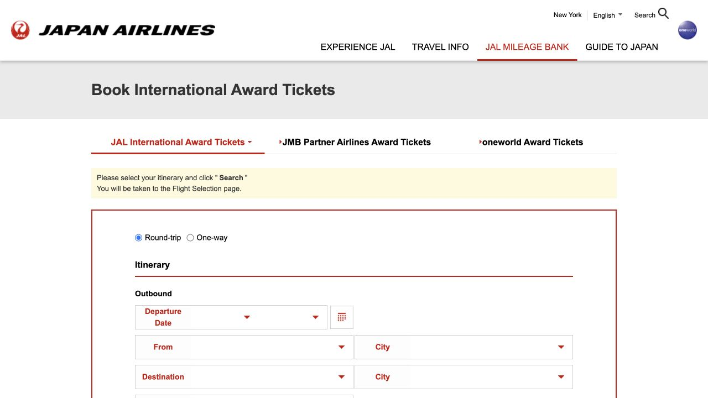
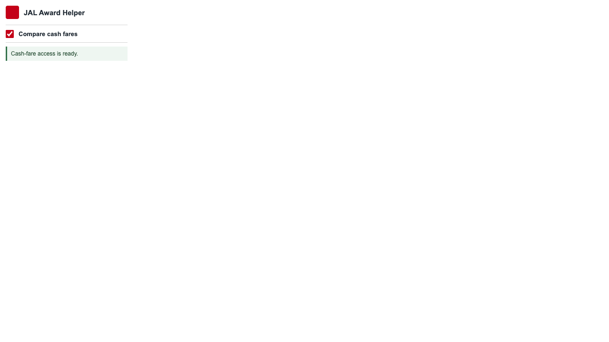

# JAL Award Helper

A Chrome extension that adds award and cash prices to JAL award calendars.





## Install

1. Download or clone this repository.
2. Run `npm install`.
3. Run `npm run build`.
4. Open `chrome://extensions`.
5. Turn on **Developer mode**.
6. Choose **Load unpacked** and select `dist/chrome-mv3`.

## Use

Open a JAL award calendar. The extension adds Economy, Premium Economy, Business, First, and optional cash prices to each date.

Use the extension popup to turn cash comparison on or off.

## Develop

```sh
npm install
npx playwright install chromium
npm run typecheck
npm run build
npm run test:e2e
```

The end-to-end tests use mocked JAL responses. The README page screenshot was captured from JAL's live award-ticket page.

## License

[MIT](LICENSE)
